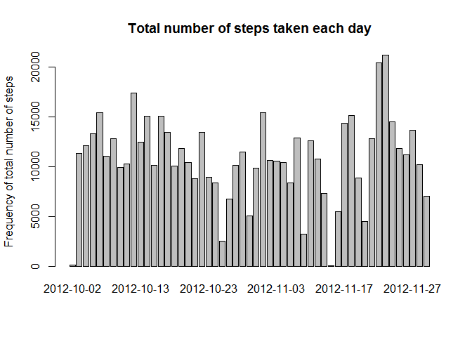

## Loading and preprocessing the data

```r
data <- read.csv(unz("Activity.zip", "activity.csv"), sep=",", header=TRUE)
```

Loading required packages

```r
library(timeDate)
library(ggplot2)
library(dplyr, warn.conflicts=F, quietly=T)
library(lattice)
```
  

## What is mean total number of steps taken per day?

Histogram of the total number of steps taken each day

```r
xt <- xtabs(steps ~ date, data=data)
barplot(xt, ylab = "Frequency of total number of steps", main="Total number of steps taken each day")
```

<!-- -->
.  

Here is the mean and median total number of steps taken per day

```r
mean(xt)
```

```
## [1] 10766.19
```

```r
median(xt)
```

```
## [1] 10765
```
## What is the average daily activity pattern?

Let´s take a look at a time series plot of 5-minute interval and the average number of steps taken, averaged across all days


```r
by_interval <- group_by(data, interval)
data_mean <- summarize(by_interval, mean_steps =mean(steps, na.rm=TRUE)) 
```

```
## `summarise()` ungrouping output (override with `.groups` argument)
```

```r
head(data_mean)
```

```
## # A tibble: 6 x 2
##   interval mean_steps
##      <int>      <dbl>
## 1        0     1.72  
## 2        5     0.340 
## 3       10     0.132 
## 4       15     0.151 
## 5       20     0.0755
## 6       25     2.09
```

Let´s see it in the plot

```r
g <- ggplot(data_mean, aes(interval, mean_steps))
g + geom_line() +
    labs(x = "5 minute interval") +
    labs (y = "Average number of steps") +
    labs(title = "Number of steps in individual intervals averaged across all days)")
```

<!-- -->
.  
Let´s look which 5-minute interval on average across all the days in the dataset, contains the maximum number of steps

```r
subset(data_mean, mean_steps==max(mean_steps))$interval
```

```
## [1] 835
```

## Imputing missing values

Total number of rows with NAs

```r
sum(!complete.cases(data))
```

```
## [1] 2304
```
Replacing NAs with mean for that 5-minute interval.  
Replacing can be seen in the first row of the dataset (value 1.716981 is the average value for interval 0)

```r
matchData = merge(data, data_mean, by="interval")
matchData$steps <- ifelse(is.na(matchData$steps), matchData$mean_steps, matchData$steps)
data_replaced <- matchData[,1:3]
head(data_replaced)
```

```
##   interval    steps       date
## 1        0 1.716981 2012-10-01
## 2        0 0.000000 2012-11-23
## 3        0 0.000000 2012-10-28
## 4        0 0.000000 2012-11-06
## 5        0 0.000000 2012-11-24
## 6        0 0.000000 2012-11-15
```
Now let´s do the histogram and mean and median again

```r
xt_replaced <- xtabs(steps ~ date, data=data_replaced)
barplot(xt_replaced, ylab = "Frequency of total number of steps", main="Total number of steps taken each day wit NAs replaced")
```

<!-- -->
.  
Here is the mean and median of total number of steps taken per day

```r
mean(xt_replaced)
```

```
## [1] 10766.19
```

```r
median(xt_replaced)
```

```
## [1] 10766.19
```

## Are there differences in activity patterns between weekdays and weekends?

Create a new factor variable in the dataset with two levels -- "weekday" and "weekend" indicating whether a given date is a weekday or weekend day.

```r
data_replaced$whichday <- isWeekday(data_replaced$date, wday=1:5)
data_replaced$whichday <- factor(ifelse(data_replaced$whichday,'weekday','weekend'))
head(data_replaced)
```

```
##   interval    steps       date whichday
## 1        0 1.716981 2012-10-01  weekday
## 2        0 0.000000 2012-11-23  weekday
## 3        0 0.000000 2012-10-28  weekend
## 4        0 0.000000 2012-11-06  weekday
## 5        0 0.000000 2012-11-24  weekend
## 6        0 0.000000 2012-11-15  weekday
```
Preparing data for the plot

```r
by_interval <- group_by(data_replaced, interval, whichday)
data_mean <- summarize(by_interval, mean_steps =mean(steps, na.rm=TRUE)) 
```

```
## `summarise()` regrouping output by 'interval' (override with `.groups` argument)
```

```r
head(data_mean)
```

```
## # A tibble: 6 x 3
## # Groups:   interval [3]
##   interval whichday mean_steps
##      <int> <fct>         <dbl>
## 1        0 weekday      2.25  
## 2        0 weekend      0.215 
## 3        5 weekday      0.445 
## 4        5 weekend      0.0425
## 5       10 weekday      0.173 
## 6       10 weekend      0.0165
```
Plot the activity pattern for weekdays and weekends

```r
xyplot(mean_steps ~ interval | whichday, data = data_mean, layout = c(1, 2), xlab="5-minute interval" , ylab="Average number of steps")
```

<!-- -->
